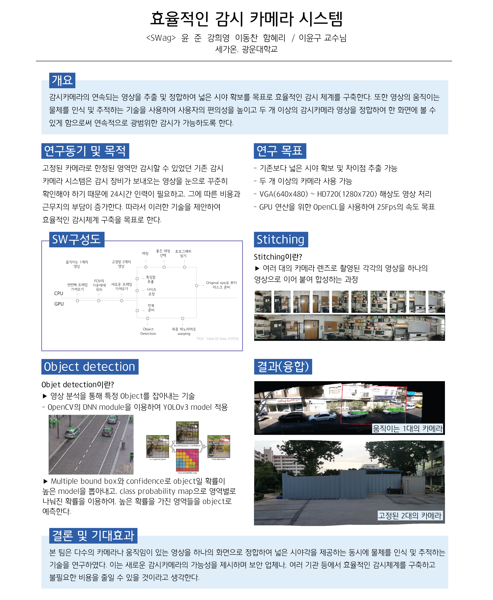

# Monitoring-System (with Stitching & Object Detection)

산학연계 프로젝트

Team SWag

## Introduction

## How To Use

1. ./x64/Release/Viewer.exe 실행

2. 설정메뉴의 스티칭 설정 확인

3. 프로젝트 메뉴 실행

* 이미지 스티칭의 경우 프로젝트 메뉴-> 이미지스티칭
* 이미지가 들어있는 폴더를 선택한 후 리스트에 올라온 이미지를 스티칭

* 비디오 파노라마, 오브젝트 디텍션, 파노라마 디텍션의 경우 파일 메뉴 -> 열기 
* 파일이 정상적으로 열리면, 첫 프레임이 화면에 나타남. 확인 후 실행

* 비디오 스티칭의 경우, 아직 실시간으로 구현하지 못하였기 때문에 결과화면만 출력하는 기능.

## Result Video

https://youtu.be/6IiHpFsoUR8
